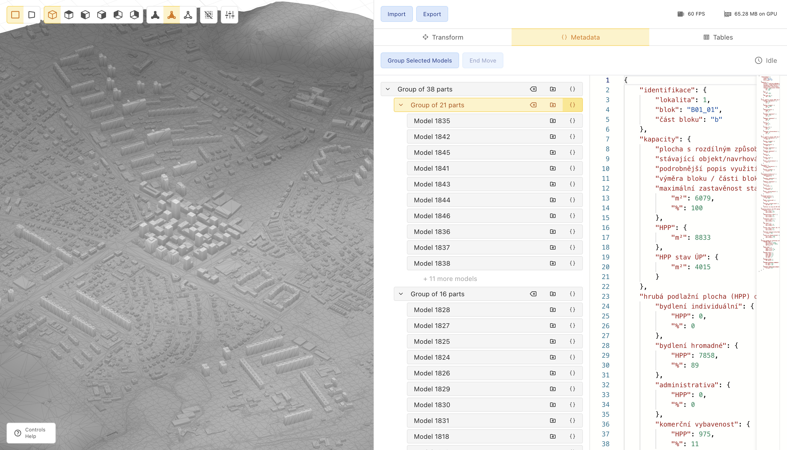

# 🏡 [Metacity Studio](https://studio.metacity.cc)

Metacity Studio is an online tool for integrating and visualization of spatial data.

Running at [studio.metacity.cc](https://studio.metacity.cc)

## [Studio](./studio)

Studio is the frontend and backend of the Metacity Studio application.

See the [README in the `studio` directory](./studio/README.md) for more information.

## Supporting services

Supporting services can be run using the [docker-compose.yml](./docker-compose.yml) file in the root of the repository.

### [Coordinates converter](coordinates_converter)

Python service to convert models between different coordinate systems.

See the [README in the `coordinates_converter`](./coordinates_converter/README.md) directory for more information.

## Development

### Devcontainer

This repository is set up to be used with the Visual Studio Code Remote - Containers extension. This allows you to develop in a containerized environment with all the necessary dependencies installed.

The devcontainer includes:
* Node.js 20
* Python 3.12
* Docker-in-Docker