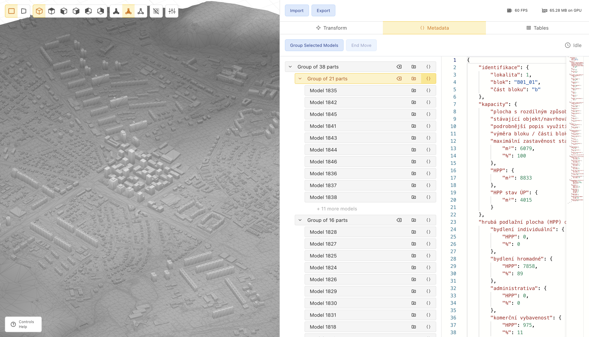

# 🏡 [Metacity Studio](https://studio.metacity.cc)

Metacity Studio is an online tool for integrating and visualizing spatial and tabular data.

Running at [studio.metacity.cc](https://studio.metacity.cc)

## How does it work?

Prepare urban visualizations online. Load your data, align it, and export it for viewing online.

-   works best with small to medium-sized datasets
-   allows yout to connect 3D models and tabular data

## What formats can you load in?

Currently:

-   SHP (Polygons and MultiPatch only for now)
-   IFC
-   GLTF (triangles only)

## Roadmap

The project is in active development. The roadmap is as follows:

### v0.3.0

-   [ ] Viewer - Details TBA
-   [ ] Optional interactivity - build BVH only if user opts-in to make the loaded models clickable

### v0.2.1

-   [ ] Project export
-   [ ] Resize guard update graphics (The "Oops" message is pretty lame)
-   [ ] Transforming original metadata to a table
-   [ ] Extract Utils to separate SDK form metacity editors

### v0.2.0 - 👨‍💻 In progress

-   [x] Infrastructure for the built-in viewer (vite setup, etc.)
-   [x] Building a hierarchy of models (floors, buildings, blocks, etc.) - ✨WIP
    -   [x] Deselect all - button and shortcut
    -   [x] Group models
    -   [x] Group groups
    -   [x] Delete groups
    -   [x] Move groups (and models)
-   [x] View settings in the annotate settings - move it to the canvas
-   [x] Loading tabular data (CSV) and linking it to the hierarchy.
    -   [x] Loading CSV
    -   [x] CSV editor
    -   [x] Multiple CSVs
    -   [x] Linking CSV rows to the hierarchy
    -   [x] Unlinking CSV rows from the hierarchy
-   [ ] Resolve table editing issues - maybe leave out table editing all togheter?

### v0.1.0 - ✅ Released

-   [x] Rectangular select
-   [x] Merge submodels
-   [x] Delete selected submodel
-   [x] Context Help

### v0.0.4 - ✅ Released

-   [x] Removed IFC metadata loading to optimize memory usage

### v0.0.3 - ✅ Released

-   [x] Selecting alignment for loaded models
-   [x] Worker pool for loading
-   [x] Status - counter, update global loading status
-   [x] Reading metadata from IFC files - inspeciton of metadata?
-   [x] CI na githubu autodeploy
-   [x] Uniforms copy on model add
-   [x] Rotate Splash screen bug

### v0.0.2 - ✅ Released

-   [x] Loading SHP - _needs our own library to load, noone supports multipatch_
-   [x] BVH build into worker
-   [x] Loading screen + Add chicken
-   [x] Add React Context
-   [x] Tabs in sidepanel
-   [x] Redesign
-   [x] Sidepanel view settings
-   [x] Intro screen

### v0.0.1 - ✅ Released

-   [x] Grid in the background
-   [x] Translucent models to see wirefame in the background
-   [x] Snap vertices
-   [x] Translation - scale - rotate
-   [x] Split models
-   [x] Hide models
-   [x] Delete model

## Backlog

-   [ ] Merge whole models
-   [ ] Loading points and lines from SHP
-   [ ] Loading GeoJSON
-   [ ] Loading IFC metadata loading (memory-efficiency???)
-   [ ] Remesh models - intersection of triangles
-   [ ] Frustum culling
