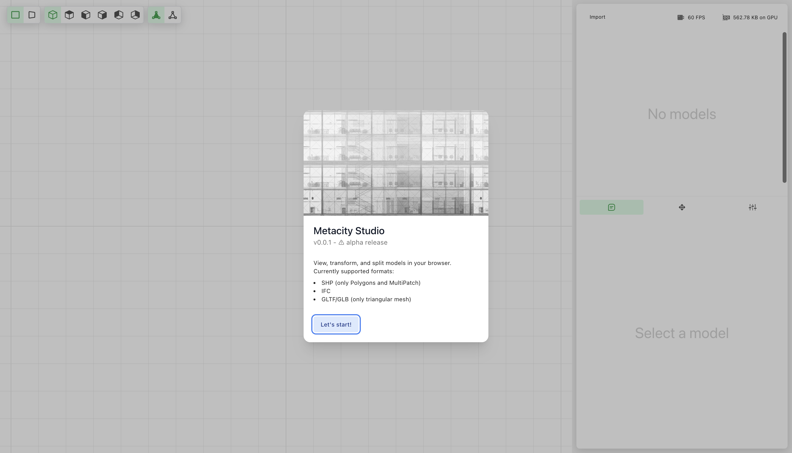

# 🏡 Metacity Studio

Metacity Studio is an online tool for integrating and visualizing spatial and tabular data.

## How does it work?

Open the app, upload your data, see what's there. That's it.

The application is front-end only, all the data processing is done in the browser.

It may seem crazy, mangling large datasets in the browser, computing geometry and on top of that, rendering it all in a 3D environment.

Only time will tell if this is a good idea.

## What formats can you load in?

Currently:

-   SHP (Polygons and MultiPatch only for now)
-   IFC
-   GLTF (triangles only)

## Roadmap

The project is in active development. The roadmap is as follows:

## v0.1.2

-   [ ] Project export
-   [ ] Project import

## v0.1.1

-   [ ] Baking/Transforming models to Table-like format
-   [ ] Allow labeling geometry

## v0.1.0

-   [x] Rectangular select
-   [x] Merge submodels
-   [ ] Delete selected submodel

## v0.0.4 - ✅ Released

-   [x] Removed IFC metadata loading to optimize memory usage

## v0.0.3 - ✅ Released

-   [x] Selecting alignment for loaded models
-   [x] Worker pool for loading
-   [x] Status - counter, update global loading status
-   [x] Reading metadata from IFC files - inspeciton of metadata?
-   [x] CI na githubu autodeploy
-   [x] Uniforms copy on model add
-   [x] Rotate Splash screen bug

## v0.0.2 - ✅ Released

-   [x] Loading SHP - _needs our own library to load, noone supports multipatch_
-   [x] BVH build into worker
-   [x] Loading screen + Add chicken
-   [x] Add React Context
-   [x] Tabs in sidepanel
-   [x] Redesign
-   [x] Sidepanel view settings
-   [x] Intro screen

## v0.0.1 - ✅ Released

-   [x] Grid in the background
-   [x] Translucent models to see wirefame in the background
-   [x] Snap vertices
-   [x] Translation - scale - rotate
-   [x] Split models
-   [x] Hide models
-   [x] Delete model

### Backlog

-   [ ] Loading points and lines from SHP
-   [ ] Loading GeoJSON
-   [ ] Loading IFC metadata loading (memory-efficiency???)
-   [ ] Remesh models - intersection of triangles
-   [ ] Frustum culling
